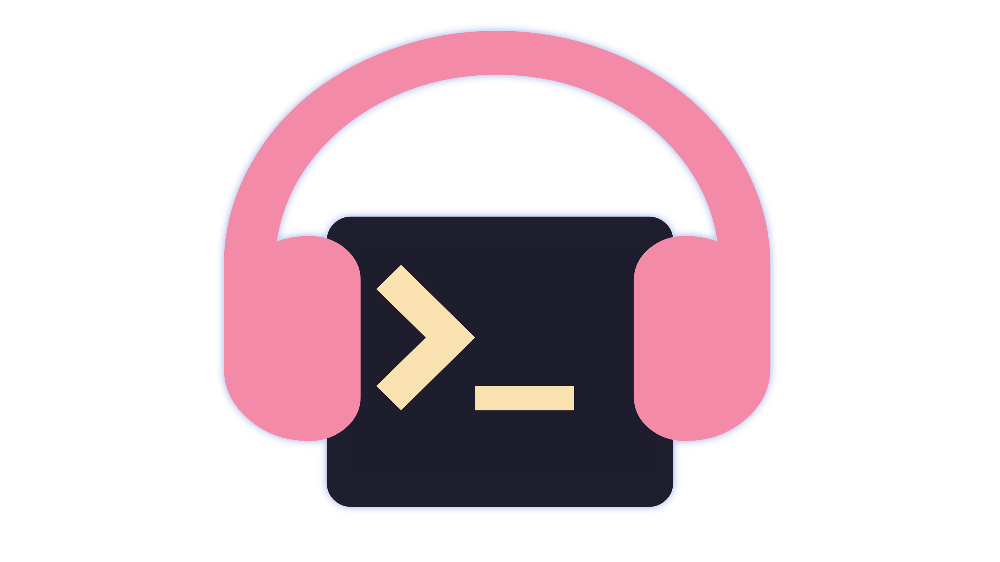
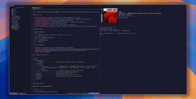

<div align="center">
    
    <br/>
    <h1>muzak</h1>
</div>

<div align="center">
  <p>
    <a href="https://github.com/thatsneat-dev/muzak/releases/latest">
      
    </a>
    <a href="https://github.com/thatsneat-dev/muzak/pulse">
      
    </a>
    <a href="https://github.com/thatsneat-dev/muzak/blob/main/LICENSE">
      
    </a>
    <a href="https://github.com/thatsneat-dev/muzak/stargazers">
      
    </a>
    <a href="https://github.com/thatsneat-dev/muzak/issues">
      
    </a>
    <a href="https://github.com/thatsneat-dev/muzak">
      
    </a>
  </p>
</div>

`muzak` is a terminal-based tool to control your Apple Music player without
needing to switch contexts.



# muzak

A live Apple Music now-playing widget for terminals that support the
[Kitty graphics protocol](https://sw.kovidgoyal.net/kitty/graphics-protocol/)
(Kitty, Ghostty, and others). Displays album artwork, track info, a playback
progress bar, and volume — all rendered inline. Controlled entirely with
vim-style keybindings.

## Features

- **Album artwork** rendered inline via the Kitty graphics protocol
- **Live playback position** with a text-based progress bar, updated every
  second
- **Playback controls** — play/pause, next/previous track
- **System volume control** via CoreAudio (instant, no osascript overhead)
- **Vertical volume bar** with nerd font icons
- **Visual feedback** — control icons flash yellow on keypress
- **Browse modal** — browse and play playlists or albums from your library
- **Auto-launch** — launches Apple Music on startup; opens browse if nothing is
  playing
- **Non-blocking architecture** — input is always responsive, polling runs in
  the background

## Keybindings

| Key     | Action                                       |
| ------- | -------------------------------------------- |
| `space` | Toggle play/pause                            |
| `h`     | Restart track (or previous track if < 3s in) |
| `l`     | Next track                                   |
| `k`     | Volume up                                    |
| `j`     | Volume down                                  |
| `s`     | Toggle shuffle                               |
| `r`     | Cycle repeat mode                            |
| `q`     | Open queue overlay                           |
| `b`     | Browse playlists and library                 |
| `x`     | Quit                                         |
| `Ctrl+C`| Quit                                         |

## Requirements

- **macOS** (uses Apple Music via AppleScript + CoreAudio)
- **Terminal with
  [Kitty graphics protocol](https://sw.kovidgoyal.net/kitty/graphics-protocol/)
  support** (Kitty, Ghostty, WezTerm, etc.)
- **[Nerd Font](https://www.nerdfonts.com/)** (for control and volume icons)
- **Go 1.26+** (or Nix)

## Codebase Structure

```
muzak/
├── cmd/muzak/
│   ├── main.go                        # Entry point, stdin reader
│   ├── app.go                         # App struct, display loop, overlays
│   └── keys.go                        # Key dispatch for all modes
├── internal/
│   ├── browse/
│   │   ├── state.go                   # Browse modal state machine and screens
│   │   ├── model.go                   # Data model, sorting, search filtering
│   │   ├── render.go                  # Browse overlay rendering
│   │   └── browse_test.go
│   ├── music/
│   │   ├── music.go                   # NowPlaying via embedded AppleScript, playback controls
│   │   ├── browse.go                  # Library browsing: playlists, albums, playback
│   │   ├── now_playing.applescript    # AppleScript: track metadata, artwork, player state
│   │   ├── queue.applescript          # AppleScript: current queue
│   │   ├── list_playlists.applescript
│   │   ├── list_albums.applescript
│   │   ├── list_album_tracks.applescript
│   │   ├── play_playlist.applescript
│   │   └── play_album.applescript
│   ├── ui/
│   │   ├── draw.go                    # Kitty graphics, progress bar, now-playing renderer
│   │   ├── icons.go                   # Nerd Font icon constants
│   │   ├── layout.go                  # Terminal size detection and layout math
│   │   ├── text.go                    # Visible-width truncation and text helpers
│   │   └── ui_test.go
│   └── volume/
│       └── volume.go                  # System volume via cgo + CoreAudio
├── tests/                             # Integration tests
├── docs/                              # Release notes and assets
├── ref/                               # Reference AppleScript snippets
├── justfile                           # Development task runner
├── VERSION                            # Semver version source of truth
├── flake.nix                          # Nix flake for dev shell and package
├── go.mod
└── go.sum
```

## Installation

### With Nix (recommended)

```sh
# Run directly
nix run github:thatsneat-dev/muzak

# Or enter a dev shell and build
nix develop
go run ./cmd/muzak
```

### With Go

```sh
# Requires Xcode Command Line Tools for cgo (CoreAudio)
go install github.com/thatsneat-dev/muzak/cmd/muzak@latest
```

### From source

```sh
git clone https://github.com/thatsneat-dev/muzak.git
cd muzak
just build
./bin/muzak
```

## Development

```sh
nix develop         # enter dev shell with all tools
just                # list available recipes
just build          # build with version injection
just fmt            # format Go + Nix code
just lint           # golangci-lint + statix + deadnix
just test           # go test -race
just vuln           # govulncheck
just check          # run all checks
just bump patch     # bump version (patch|minor|major)
```

## License

[MIT](LICENSE) © [thatsneat.dev](https://thatsneat.dev)
